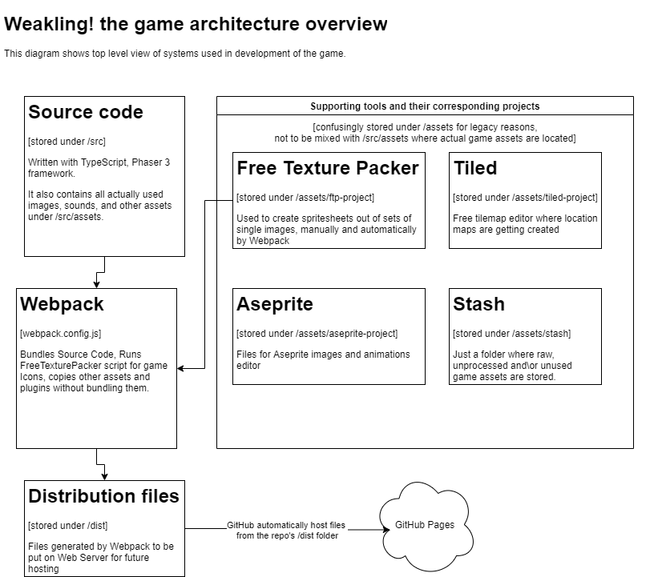

# Contribution Guide

## **Table Of Contents**
[Welcome](#welcome) \
[Submitting Pull Requests](#submitting-pull-requests) \
[Source Code Structure](#source-code-structure) \
[Assets](#assets)
* [Tilemaps](#tilemaps)
* [Tilesets](#tilesets)
* [Spritesheets](#spritesheets)
* [Audio](#audio)

# Welcome
First off, thank you for taking the time to contribute! :) Before making any changes to the game, please share your idea on the [Discord server](https://discord.gg/7E5B8Jp8) or by submitting a Github issue. Also, have a look at the [project board](https://github.com/Nightspeller/Weakling/projects/1) to get an overview of project tasks.

# Submitting Pull Requests
Submit one pull request per bug fix or feature

# Source Code Structure

# Assets
If you use someone else's work, make sure you read the license of the asset. If you do not know the conditions for using a specific license, you will find more information [here](https://choosealicense.com/non-software/). If credits are required, be sure to add it to [credit.md](./credit.md)

We have two asset folders in the repository. One on the top level and another one inside the **/src**.

**/assets** \
The top-level assets folder should be only for stash, Tiled files, unexported maps, Free Texture Packer files, and so on.

An exception to this rule is icons. Now they are stored as separate named pictures under **/assets/ftp-project/icons** and *automatically* converted to a single spritesheet 'icons' via Webpack pipeline. So if you want to add an icon, simply drop it into the correct folder.

**/src/assets** \
All assets used in the game, like images, atlases, and exported Tiled maps should go under **/src**. 

## Tilemaps
We are using [Tiled Map Editor](https://www.mapeditor.org/) for making and maintaining the tilemaps of the game. 

If you're adding a new tilemap, make sure the textures never exceed more than 4096px in one dimension. This is a requirement in order to play the game on the Android version (89.0.4389) of Chrome. 

Merging maps is much more difficult than merging the code, so ideally only one person should work on the same map in the given time, so we will not be touching it knowing that you might want to do any changes to it. Before you make any changes, make sure to check the [project board](https://github.com/Nightspeller/Weakling/projects/1), or ask a question on the [Discord server](https://discord.gg/7E5B8Jp8) to make sure no one is working on the tilemap you are considering changing.  

## Tilesets
Before adding new tileset(s) to the game, make sure to extrude the tileset image(s). You can use [Tile Extruder](https://github.com/sporadic-labs/tile-extruder) to extrude the images. 

## Spritesheets

We use [Free Texture Packer](http://free-tex-packer.com/) to pack multiple images into one spritesheet

Notice that we have two asset folders in the repository. One on the top level and another one inside the **/src**. You can put the Free Texture Packer files and icons in the top-level assets folder. The icons are stored as separate named pictures under */assets/ftp-project/icons* and automatically converted to a single spreadsheet 'icons' via Webpack pipeline. So if you want to add an icon, simply drop it into the correct folder.

This approach allows us to easily (well, more or less) categorize every icon and find it in the future, while the automated pipeline compiles all icons into one big sheet which is better for performance. Another benefit is that we can say what is on the icon without actually opening it. Like try guessing what is (texture: 'edited', frame: 136) reading the code, vs (texture: 'icons', frame: 'icons/weapons/melee/dagger-iron'). *Free texture packer* has a Webpack plugin that we use, which takes all separate icons and glues them into one big image set (single file) before creating the bundle, so when it gets served to the browser it is just one big image.

If you still want to see all icons in one big sheet, you can just download [free texture packer](http://free-tex-packer.com/) and open "icons.ftpp" file in it.

**/src/assets**
All assets used in the game, like images, atlases, and exported Tiled maps should go under /src.

## Audio 
Format requirements: mp3 and ogg 

If your audio file is in another format, you can easily convert the files in [Audacity](https://www.audacityteam.org/)